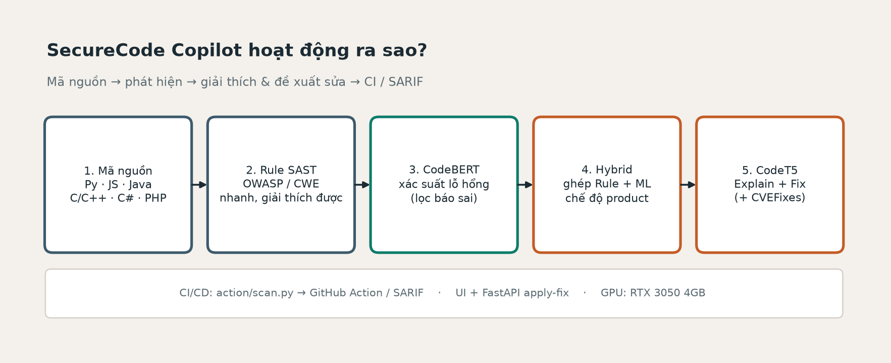
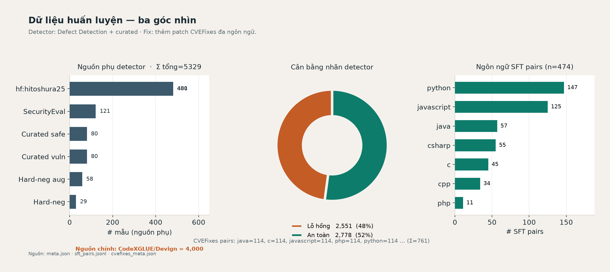
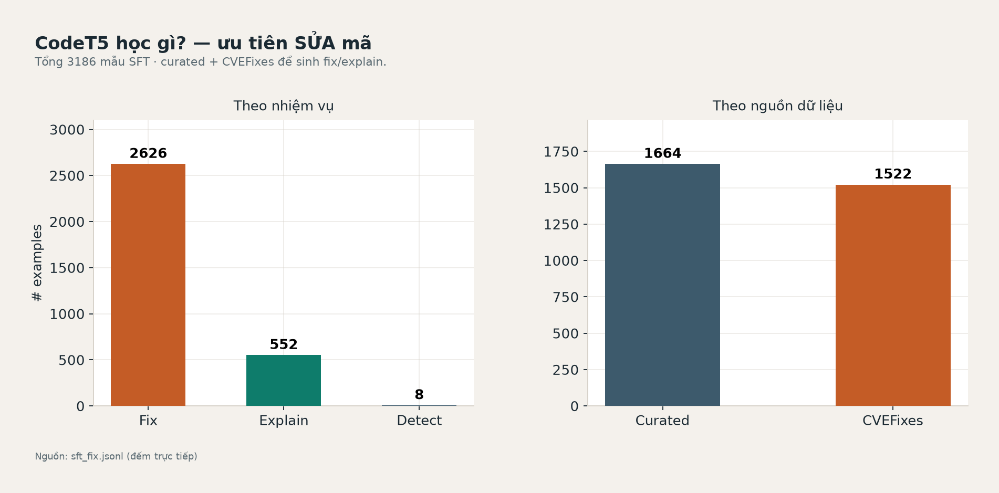
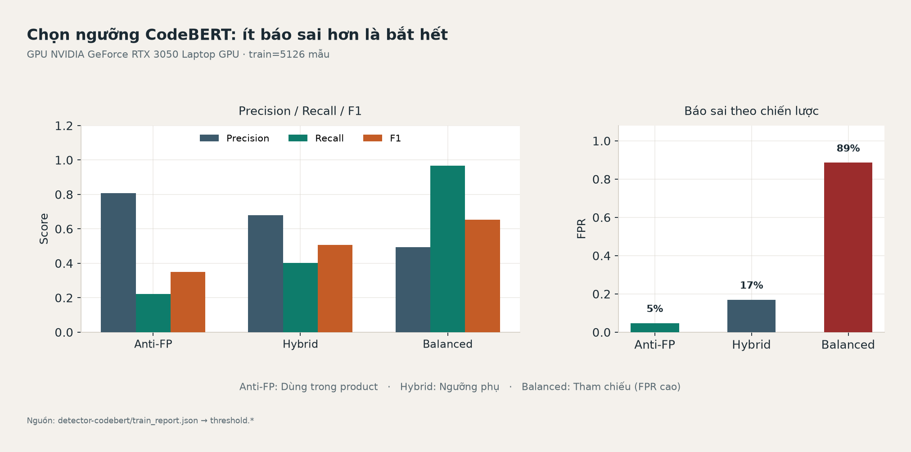
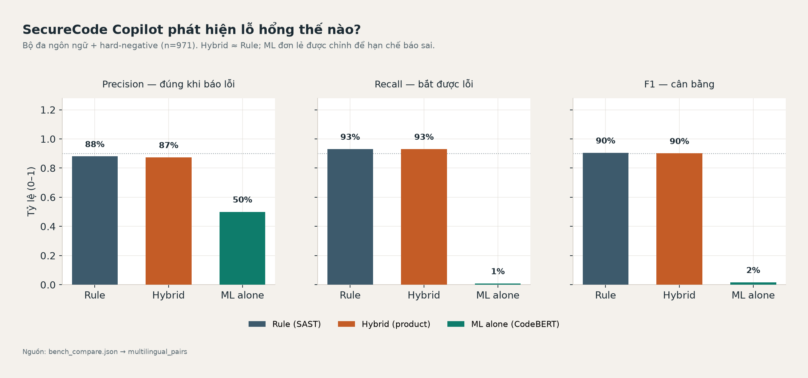
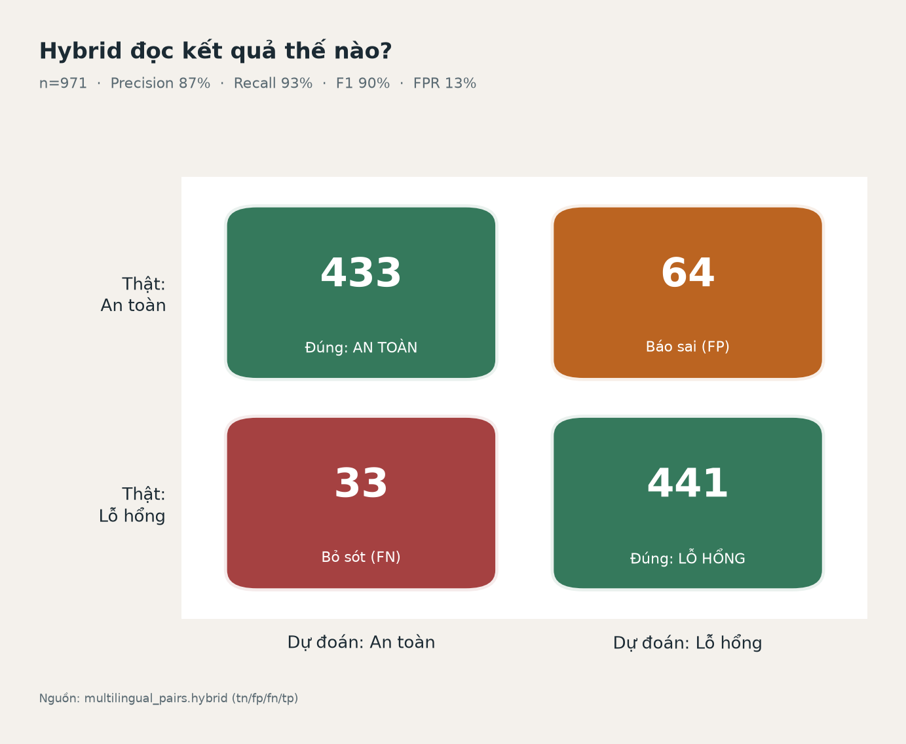
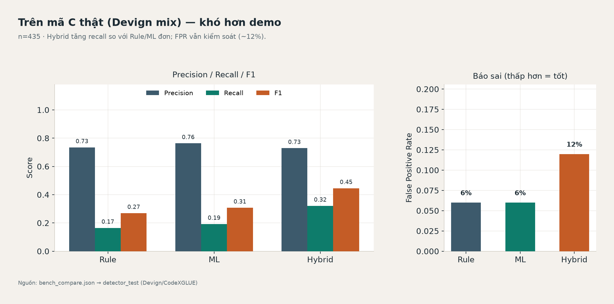
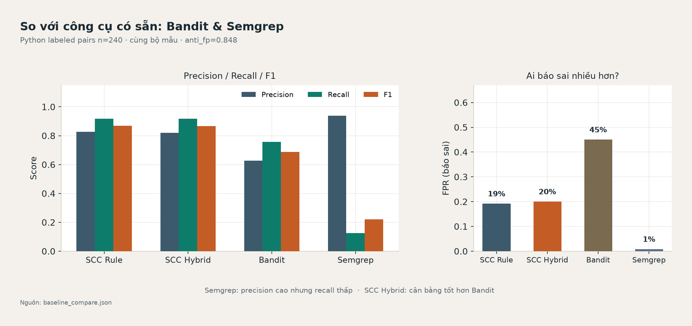
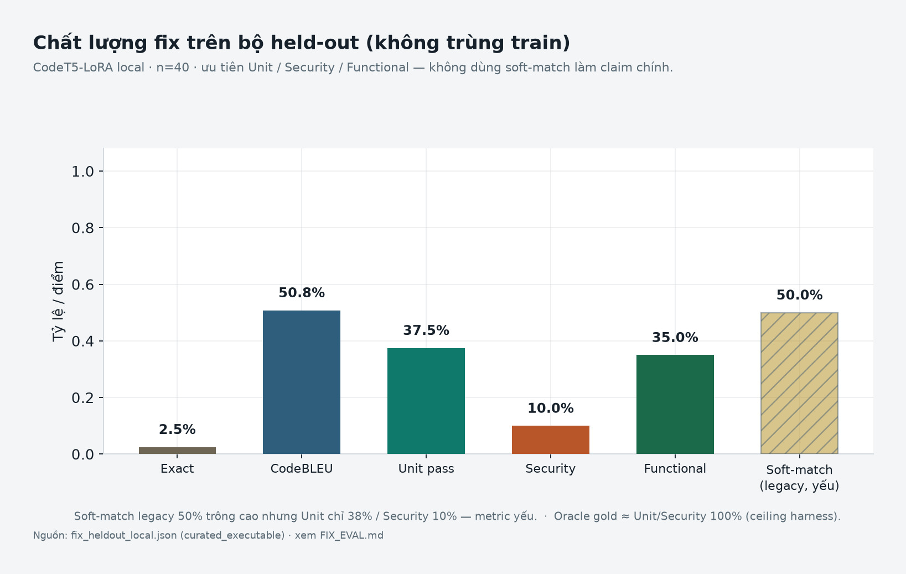
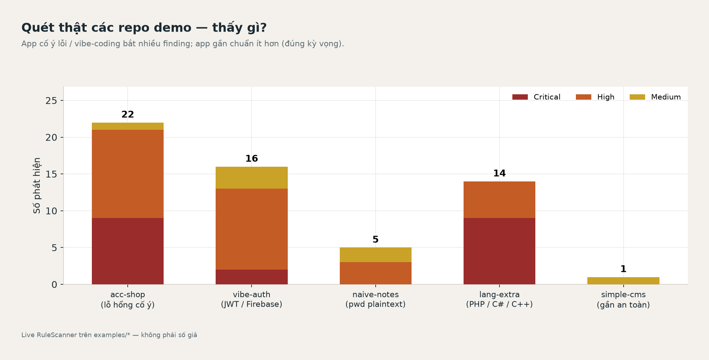

# SecureCode Copilot

### Fine-tuning mô hình ngôn ngữ cho phát hiện, giải thích và đề xuất sửa lỗ hổng bảo mật trên mã nguồn đa ngôn ngữ, tích hợp CI/CD

<p align="center">
  
</p>

<p align="center">
  <em>Hình 1. Luồng xử lý end-to-end: Rule SAST → CodeBERT (lọc FP) → Hybrid → CodeT5 (explain/fix) → CI/SARIF.</em>
</p>

---

## Tóm tắt

**SecureCode Copilot** là hệ thống hỗ trợ kỹ sư phần mềm viết mã an toàn hơn bằng cách kết hợp:

1. **Phân tích tĩnh dựa trên rule** (map CWE / OWASP, đa ngôn ngữ, giải thích được),
2. **Bộ phân loại CodeBERT fine-tune** để ước lượng xác suất lỗ hổng và **giảm báo sai (false positive)**,
3. **CodeT5-LoRA** để sinh giải thích ngữ cảnh và gợi ý sửa,
4. **Tích hợp CI/CD** qua GitHub Actions (SARIF gate + deploy GHCR/VPS).

Hệ thống phục vụ mục tiêu đồ án tốt nghiệp: chứng minh pipeline *detect → explain → fix → gate CI → deploy CD* chạy được trên phần cứng phổ thông (RTX 3050 4GB).

| Khía cạnh | Giá trị |
|-----------|---------|
| Ngôn ngữ | Python, JavaScript/TypeScript, Java, C/C++, C#, PHP |
| Chế độ detect | Rule-only · Hybrid (product) · ML discovery (tuỳ chọn) |
| LLM | `heuristic` · `local` (CodeT5-LoRA) · `openai` |
| CI / CD | GitHub Actions + SARIF; GHCR + VPS Compose ([`docs/CD.md`](docs/CD.md)) |

---

## 1. Đặt vấn đề

Công cụ SAST rule-based bắt tốt các mẫu quen thuộc nhưng hạn chế về giải thích và đề xuất vá. LLM mục đích chung viết mô tả hay nhưng thiếu ổn định, dễ ảo giác, và khó gắn vào gate CI.

SecureCode Copilot tách rõ vai trò:

- **Rule** — bắt pattern đã biết (recall cao trên class phổ biến),
- **CodeBERT** — chấm điểm ngữ cảnh để *giữ / bỏ* finding (ưu tiên giảm FP),
- **CodeT5** — diễn giải và gợi ý patch; khi sinh kém thì fallback template có kiểm soát.

---

## 2. Kiến trúc hệ thống

```
React UI  ──REST──▶  FastAPI
                       ├─ RuleScanner (CWE / OWASP)
                       ├─ CodeBERT hybrid filter
                       ├─ LocalLLM / Heuristic / OpenAI
                       └─ Apply-fix · Batch · Repo ZIP/GitHub

GitHub Actions ──▶ action/scan.py ──▶ JSON + SARIF artifact
ML pipeline    ──▶ dataset → train CodeBERT / CodeT5-LoRA → checkpoints
```

Chi tiết thiết kế: [`docs/ARCHITECTURE.md`](docs/ARCHITECTURE.md) · Demo: [`docs/DEMO.md`](docs/DEMO.md).

---

## 3. Dữ liệu huấn luyện

Detector được huấn luyện trên hỗn hợp **CodeXGLUE Defect Detection (Devign)**, mẫu curated / vibe-coding, **hard-negatives**, SecurityEval và cặp CVEFixes. Nhánh SFT (explain/fix) mở rộng bằng patch đa ngôn ngữ từ CVEFixes.

<p align="center">
  
</p>

<p align="center">
  <em>Hình 2. Thành phần dữ liệu: nguồn detector (Σ ≈ 5 329), cân bằng nhãn, phân bố ngôn ngữ SFT.</em>
</p>

<p align="center">
  
</p>

<p align="center">
  <em>Hình 3. Phân bố nhiệm vụ SFT (detect / explain / fix) và nguồn curated vs CVEFixes.</em>
</p>

---

## 4. Kết quả thực nghiệm

### 4.1. Detector CodeBERT — chiến lược ngưỡng

Trên GPU **RTX 3050 4GB**, train ≈ **6 322** mẫu (oversample). Product ưu tiên chiến lược **Anti-FP** (precision cao, FPR thấp) thay vì Maximized F1 với FPR không chấp nhận được trên sản phẩm.

<p align="center">
  
</p>

<p align="center">
  <em>Hình 4. Anti-FP · Hybrid · Balanced — trade-off precision / recall / FPR.</em>
</p>

### 4.2. Rule · Hybrid · ML trên bộ đa ngôn ngữ

<p align="center">
  
</p>

<p align="center">
  <em>Hình 5. Precision / Recall / F1 trên tập đa ngôn ngữ + hard-negative.</em>
</p>

<p align="center">
  
</p>

<p align="center">
  <em>Hình 6. Ma trận nhầm lẫn chế độ Hybrid (product).</em>
</p>

### 4.3. Đối chiếu trên mã C (Devign mix) và baseline

<p align="center">
  
</p>

<p align="center">
  <em>Hình 7. So sánh Rule / ML / Hybrid trên detector test kiểu Devign.</em>
</p>

<p align="center">
  
</p>

<p align="center">
  <em>Hình 8. So với Bandit và Semgrep trên bộ cặp Python có nhãn (xem số liệu trong report).</em>
</p>

Bảng tóm tắt baseline (Python labeled pairs):

| Phương pháp | Precision | Recall | F1 | FPR |
|-------------|-----------|--------|----|-----|
| SCC Rule-only | 0.827 | 0.917 | 0.870 | 0.192 |
| SCC Hybrid | 0.821 | 0.917 | 0.866 | 0.200 |
| Bandit | 0.628 | 0.758 | 0.687 | 0.450 |
| Semgrep | 0.938 | 0.125 | 0.221 | 0.008 |

Chi tiết: [`ml/eval/reports/baseline_compare.md`](ml/eval/reports/baseline_compare.md) · [`ml/eval/reports/bench_compare.md`](ml/eval/reports/bench_compare.md) · **[per-language multilingual](ml/eval/reports/bench_multilingual.md)**.

### 4.4. CodeT5 — chất lượng gợi ý sửa (held-out)

**Claim chính (held-out, không trùng fingerprint train):** Exact · CodeBLEU · Compile · **Unit-test** · **Security-test** · Functional — chi tiết [`ml/eval/FIX_EVAL.md`](ml/eval/FIX_EVAL.md).

Số liệu minh họa checkpoint hiện tại (`fix_heldout_local`, curated executable **n=40**):

| Metric | CodeT5-LoRA local | Oracle (ceiling) |
|--------|-------------------|------------------|
| Exact match | ~2.5% | 100% |
| CodeBLEU (mean) | ~0.51 | 1.00 |
| Unit-test pass | ~37.5% | 100% |
| Security-test pass | ~10% | 100% |
| Soft-match legacy | ~50% *(không dùng làm claim)* | 100% |

CVEFixes holdout cho lần retrain tiếp theo: **157** pairs (`cvefixes_holdout_next_retrain.jsonl`); SFT file đã exclude id+fingerprint (`rebuild_sft_exclude_holdout.py`). Leakage check: [`ml/eval/reports/leakage_check.md`](ml/eval/reports/leakage_check.md).

> Soft-match trên `sft_pairs` (~60%+) **không** phải kết quả chính — metric yếu và dễ trùng họ dữ liệu train.

```powershell
.\.venv-ml\Scripts\python.exe ml\datasets\build_heldout_fix_eval.py
.\.venv-ml\Scripts\python.exe ml\eval\check_fix_leakage.py
.\.venv-ml\Scripts\python.exe ml\eval\eval_fix_heldout.py --provider local
```

<p align="center">
  
</p>

<p align="center">
  <em>Hình 9. Held-out fix metrics (Unit/Security/Functional ưu tiên; soft-match chỉ cột phụ).</em>
</p>

### 4.5. Bằng chứng quét repo demo

<p align="center">
  
</p>

<p align="center">
  <em>Hình 10. Số finding theo severity trên các repo trong `examples/` (RuleScanner).</em>
</p>

---

## 5. Chạy nhanh

### Yêu cầu

- Python 3.11+ · Node.js 20+  
- (Tuỳ chọn) CUDA cho inference CodeBERT / CodeT5  
- Docker (tuỳ chọn)

### Backend (SaaS MVP)

```bash
cd backend
# khuyến nghị: dùng .venv ở root hoặc tạo mới
pip install -r requirements.txt
copy .env.example .env   # DATABASE_URL, JWT_SECRET, LLM_PROVIDER
python -m app.db.seed    # plans + demo users (cũng chạy lúc startup)
uvicorn app.main:app --host 127.0.0.1 --port 8000
```

API docs: http://127.0.0.1:8000/docs

**Tài khoản demo (sau seed):**

| Email | Mật khẩu | Gói / role |
|-------|----------|------------|
| `admin@securecode.dev` | `Admin123!` | Pro · SUPER_ADMIN |
| `free@securecode.dev` | `Free1234!` | Free |
| `pro@securecode.dev` | `Pro12345!` | Pro |
| `team@securecode.dev` | `Team1234!` | Team |

> Recommendation trên máy đã fine-tune: đặt `LLM_PROVIDER=local` và chạy backend bằng **`.venv-ml`** (có `torch` / `peft`) để CodeT5 thực sự được nạp. Trên Windows tránh `--reload` nếu muốn giữ cùng interpreter.

### Frontend (React Router + Tailwind)

```bash
cd frontend
npm install
npm run dev
```

UI: http://127.0.0.1:5173 — landing / pricing / auth / dashboard / admin.

### Docker Compose

```bash
docker compose up --build
```

### Fine-tune (local)

Xem [`ml/FINETUNE.md`](ml/FINETUNE.md):

```powershell
powershell -ExecutionPolicy Bypass -File scripts\train_local.ps1
```

Tái tạo biểu đồ luận văn:

```powershell
.\.venv-ml\Scripts\python.exe ml\eval\make_report_figures.py
```

---

## 5b. SaaS MVP — kiến trúc & trạng thái

```
React (Vite + Tailwind + Router)
  │ JWT Bearer
  ▼
FastAPI
  ├─ Auth / JWT / quota (SQLAlchemy · SQLite hoặc Postgres)
  ├─ Analyses → CopilotService.scan (giữ rule + CodeBERT + CodeT5)
  ├─ Billing mock (checkout → mock-pay)
  └─ Admin (users · payments · analyses · audit)
```

| Đã có | Đang mock / sau MVP |
|-------|---------------------|
| Register/login, JWT, forgot-password stub | Stripe webhook thật, OAuth Google/GitHub |
| Quota theo gói + 402 `QUOTA_EXCEEDED` | Team invite đầy đủ, 2FA, Enterprise SSO |
| History analyses, feedback / false-positive | PDF export thật |
| Checkout mock + nâng gói server-side | GitHub/GitLab app integrations |
| Admin lock/quota/audit | — |
| Dark mode · Be Vietnam Pro · JetBrains Mono | — |

Legacy endpoints `/scan`, `/explain`, `/fix`, `/apply-fix`, `/scan/repo*` **vẫn giữ** (CI / demo mở). Luồng SaaS analyze: `POST /api/v1/analyses` (auth + quota).

Migrate: MVP dùng `init_db()` / `create_all` lúc startup; Alembic baseline nằm ở `backend/alembic/` cho Postgres sau này.

Kiểm thử:

```bash
cd backend && pytest tests/test_api.py tests/test_saas.py -q
cd frontend && npm run build
```

## 6. CI / CD (GitHub Actions)

**CI** — [`.github/workflows/securecode-scan.yml`](.github/workflows/securecode-scan.yml)

| Job | Việc làm |
|-----|----------|
| `backend-tests` | `pytest` |
| `security-scan-rule` | Quét `examples/*` bằng rule, xuất SARIF |
| `frontend-build` | `npm run build` |
| `security-scan-hybrid` | Chỉ khi chạy tay (`workflow_dispatch`, mode `hybrid`) |

Chạy local (khi GitHub Actions bị khoá billing): `powershell -File scripts/ci_local.ps1`

**CD** — [`.github/workflows/cd.yml`](.github/workflows/cd.yml): build/push GHCR → deploy VPS (Compose) → smoke `/api/v1/health` → rollback. Chi tiết: [`docs/CD.md`](docs/CD.md). Staging local: `powershell -File scripts/staging_local.ps1` (mặc định http://127.0.0.1:18088).

Composite action: [`action/`](action/). Repo demo: [vanchungnguyxn/securecode-copilot](https://github.com/vanchungnguyxn/securecode-copilot).

> **Lưu ý:** job Actions cần tài khoản GitHub không bị khoá billing. Có thể chạy tương đương local bằng `action/scan.py` (đã kiểm chứng trên máy phát triển).

---

## 7. Cấu trúc thư mục

```
securecode-copilot/
├── backend/                 # FastAPI: auth · analyses · billing · scan AI
├── frontend/                # React + Vite SaaS (Router · Tailwind)├── ml/
│   ├── datasets/            # Chuẩn bị dữ liệu + mẫu SFT
│   ├── training/            # train_detector · train_codet5_lora
│   ├── eval/reports/        # Số liệu + figures luận văn
│   └── inference/checkpoints/  # (không commit) model local
├── action/                  # GitHub Action composite
├── deploy/                  # Script deploy / rollback VPS
├── docker-compose.prod.yml  # Stack production (GHCR images)
├── examples/                # Repo demo có lỗ hổng / gần an toàn
├── docs/                    # Kiến trúc · kịch bản demo · CD
└── scripts/                 # train_local · demo_scan
```

### Biến môi trường (`backend/.env`)

| Biến | Ý nghĩa |
|------|---------|
| `LLM_PROVIDER` | `heuristic` \| `local` \| `openai` |
| `USE_ML_DETECTOR` | Bật lọc FP bằng CodeBERT |
| `USE_ML_DISCOVERY` | Bật discovery thuần ML (mặc định tắt) |
| `OPENAI_API_KEY` | Chỉ khi `openai` |
| `CORS_ORIGINS` | Origin frontend |
| `DATABASE_URL` | `sqlite:///./scc.db` hoặc Postgres |
| `JWT_SECRET` | Secret ký access token |
| `BILLING_MOCK` | `true` → `/billing/mock-pay` (dev) |
| `EMAIL_*` / `STRIPE_*` | Stub / placeholder |
---

## 8. Hạn chế và hướng mở rộng

- CodeT5 trên 4GB VRAM dễ sinh lặp; hệ thống có gate chống degenerate và fallback heuristic theo rule.  
- Anti-FP làm giảm recall discovery; product dựa **rule + hybrid filter**.  
- Fix held-out (unit/security) còn thấp — cần retrain sau khi `rebuild_sft_exclude_holdout.py` loại CVEFixes reserve.  
- **CD đã có** (GHCR + Compose/VPS, smoke, rollback) — xem [`docs/CD.md`](docs/CD.md). GitHub-hosted Actions cần tài khoản không bị khoá billing.  
- Hướng mở: hard-negative theo CWE, upload SARIF vào GitHub Code Scanning, mở rộng executable fix eval đa ngôn ngữ.

---

## Giấy phép

MIT — phục vụ mục đích học thuật / đồ án tốt nghiệp.

<p align="center">
  <sub>Figures được sinh bằng <code>ml/eval/make_report_figures.py</code> · cập nhật theo checkpoint và meta dữ liệu gần nhất.</sub>
</p>
